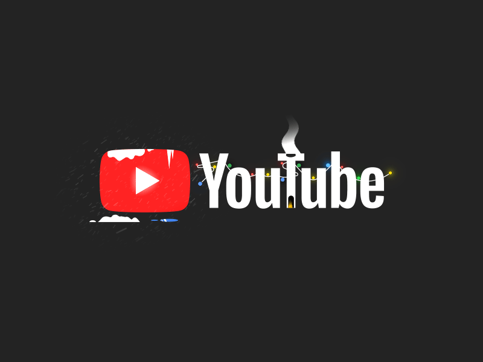

# Web Scraping Project:

**In this project we will `scrap` the `data science famous channels` form the `Youtube` and then we `perform analysis` on the `channels.`**
___
* `Website page Link`: [Click Me](https://youtube.com)
* `Date`: 04/06/2023
* `Author`: Malik Hasnain Ali
* `Helper Youtube Channel name`: techTFQ
* `Helping Youtube video link`: [Click Here](https://www.youtube.com/watch?v=SwSbnmqk3zY&list=PLavw5C92dz9HwT_uStsDdJbuBOt_XD0ch&index=1)

**`Tools Used:`**
- google-api-python-client
- build
- pandas
- numpy
- seaborn
- matplotlib
- Youtube API
